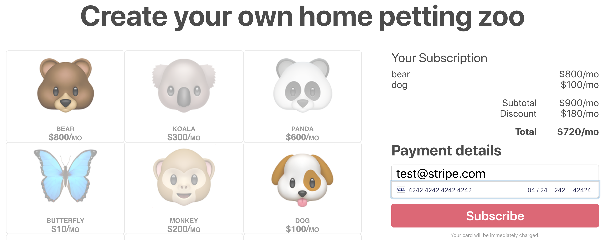
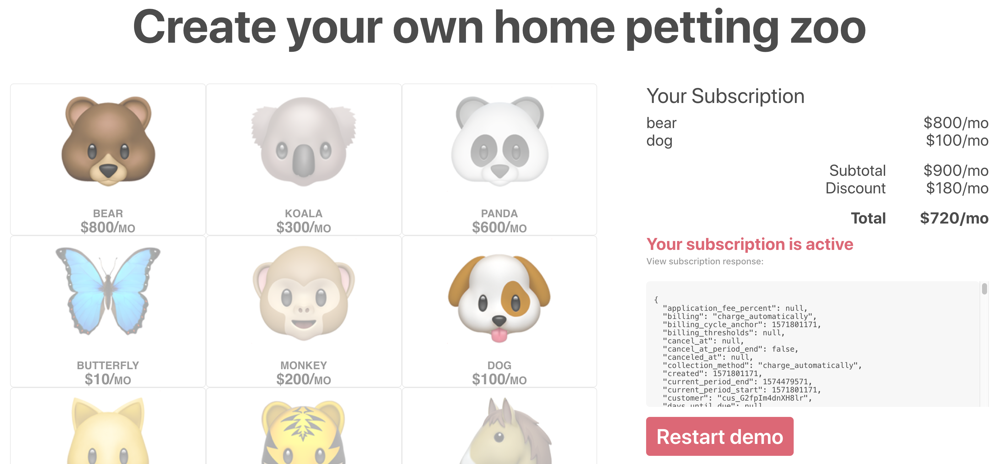

# Stripe Billing subscribing a customer to multiple products

This sample shows how to create a customer and subscribe them to multiple flat rate plans with
[Stripe Billing](https://stripe.com/billing). For step by step directions showing how to
implement this, use the [Stripe Billing quickstart](https://stripe.com/docs/billing/quickstart) (you may also find [Working with Multiple Plans per Subscription](https://stripe.com/docs/billing/subscriptions/multiplan) helpful).

A quick screenshot of the demo view:



Features:

- Collect card details 💳
- Subscribe a customer to multiple products in Stripe Billing 🦁🐯🐻
- Apply a discount when a customer purchases more than one product 💰

## How to run locally

This sample includes [5 server implementations](server/README.md) in our most popular languages. 

If you want to run the sample locally, copy the .env.example file to your own .env file in this directory: 

```
cp .env.example .env
```

You will need a Stripe account with its own set of [API keys](https://stripe.com/docs/development#api-keys), as well as a .env file updated with your account's keys.

You will also need to [add your phone number to your Stripe account](https://dashboard.stripe.com/phone-verification) in order to use the provided scripts (required in order to pass a credit card number directly to the API through curl).

After that, run the bootstrap script to create the billing objects referenced by the client and server within your account (uses the provided API keys from your .env file):

```
./scripts/bootstrap.sh
```

When finished, run the cleanup script to delete the generated objects:

```
./scripts/cleanup.sh
```

## FAQ

Q: Why did you pick these frameworks?

A: We chose the most minimal framework to convey the key Stripe calls and concepts you need to understand. These demos are meant as an educational tool that helps you roadmap how to integrate Stripe within your own system independent of the framework.

Q: Can you show me how to build X?

A: We are always looking for new sample ideas, please email dev-samples@stripe.com with your suggestion!

## Author(s)

- [@abhishek-stripe](https://github.com/abhishek-stripe)
- [@camilo-stripe](https://github.com/camilo-stripe)
- [@ctrudeau-stripe](https://twitter.com/trudeaucj)
- [@dylanw-stripe](https://github.com/dylanw-stripe)
- [@markt-stripe](https://github.com/markt-stripe)
- [@seanfitz-stripe](https://github.com/seanfitz-stripe)
