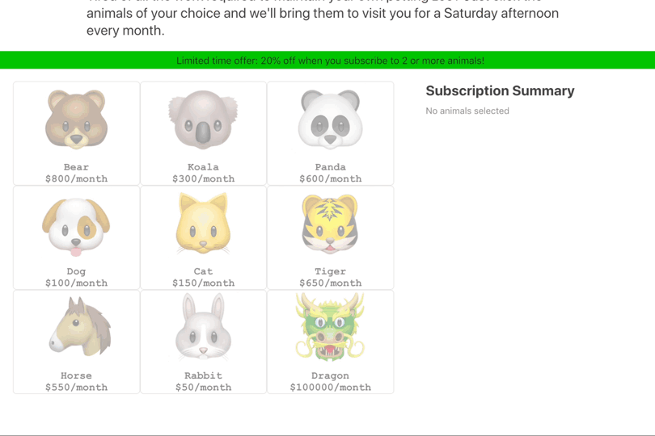

# Stripe Billing sample subscribing a customer to multiple products

This sample shows how to create a customer and subscribe them to multiple products with
[Stripe Billing](https://stripe.com/billing). For step by step directions showing how to
implement this, use the [Stripe Billing quickstart](https://stripe.com/docs/billing/quickstart) (you may also find [Working with Multiple Products per Subscription](https://stripe.com/docs/billing/subscriptions/multiplan) helpful).



# Demo

Web: See the sample [live](https://bio87.sse.codesandbox.io/) in test mode or [fork](https://codesandbox.io/s/stripe-billing-multiplan-subscription-quickstart-zph6v) the Node implementation on CodeSandbox.
iOS and Android: Clone this repo and run the sample server and app locally (see below).

Features:

- Collect card details 💳
- Subscribe a customer to multiple products in Stripe Billing 🦁🐯🐻
- Apply a discount when a customer purchases more than one product 💰

## How to run locally

This sample includes [5 server implementations](server/README.md) in our most popular languages. 

You will need a Stripe account with its own set of [API keys](https://stripe.com/docs/development#api-keys), as well as a .env file updated with your account's keys.

You will also need to [add your phone number to your Stripe account](https://dashboard.stripe.com/phone-verification) in order to use the provided scripts (required in order to pass a credit card number directly to the API through curl).

Follow the steps below to run locally.

**1. Clone and configure the sample**

The Stripe CLI is the fastest way to clone and configure a sample to run locally. 

**Using the Stripe CLI**

If you haven't already installed the CLI, follow the [installation steps](https://github.com/stripe/stripe-cli#installation) in the project README. The CLI is useful for cloning samples and locally testing webhooks and Stripe integrations.

In your terminal shell, run the Stripe CLI command to clone the sample:

```
stripe samples create multiple-plan-subscriptions
```

The CLI will walk you through picking your integration type, server and client languages, and configuring your .env config file with your Stripe API keys. 

**Installing and cloning manually**

If you do not want to use the Stripe CLI, you can manually clone and configure the sample yourself:

```
git clone https://github.com/stripe-samples/charging-for-multiple-plan-subscriptions
```

Copy the .env.example file into a file named .env in the folder of the server you want to use. For example:

```
cp .env.example server/node/.env
```

Go to the Stripe [developer dashboard](https://stripe.com/docs/development#api-keys) to find your API keys.

```
STRIPE_PUBLISHABLE_KEY=<replace-with-your-publishable-key>
STRIPE_SECRET_KEY=<replace-with-your-secret-key>
```

`CLIENT_DIR` tells the server where to the client files are located and does not need to be modified unless you move the server files.

**2. Follow the server instructions on how to run:**

If you used the CLI to install the repo, follow the instructions in server/README.md

```
cd server # there's a README in this folder with instructions
npm install
npm start
```

If you manually cloned the repo, pick the server language you want and follow the instructions in the server folder README on how to run.

For example, if you want to run the Node server:

```
cd server/node # there's a README in this folder with instructions
npm install
npm start
```

**3. Generating Test Products and Prices:**
You'll need to load the products, prices and coupon this sample uses into your Stripe account. These objects are defined in products-and-prices.json. Use the Stripe CLI [fixtures](https://stripe.com/docs/cli/fixtures) command to create them in the test mode within your Stripe account: 

```
stripe fixtures products-and-prices.json
```

To delete the data you can either delete the objects individually using the [CLI](https://stripe.com/docs/cli/delete) or delete your test data from the developer's page within your [Dashboard](https://dashboard.stripe.com/test/developers)

## FAQ

Q: Why did you pick these frameworks?

A: We chose the most minimal framework to convey the key Stripe calls and concepts you need to understand. These demos are meant as an educational tool that helps you roadmap how to integrate Stripe within your own system independent of the framework.

## Get support
If you found a bug or want to suggest a new [feature/use case/sample], please [file an issue](../../issues).

If you have questions, comments, or need help with code, we're here to help:
- on [IRC via freenode](https://webchat.freenode.net/?channel=#stripe)
- on Twitter at [@StripeDev](https://twitter.com/StripeDev)
- on Stack Overflow at the [stripe-payments](https://stackoverflow.com/tags/stripe-payments/info) tag
- by [email](mailto:support+github@stripe.com)

## Author(s)

- [@abhishek-stripe](https://github.com/abhishek-stripe)
- [@camilo-stripe](https://github.com/camilo-stripe)
- [@ctrudeau-stripe](https://twitter.com/trudeaucj)
- [@dylanw-stripe](https://github.com/dylanw-stripe)
- [@markt-stripe](https://github.com/markt-stripe)
- [@seanfitz-stripe](https://github.com/seanfitz-stripe)
- [@dawn-stripe](https://github.com/dawn-stripe)
